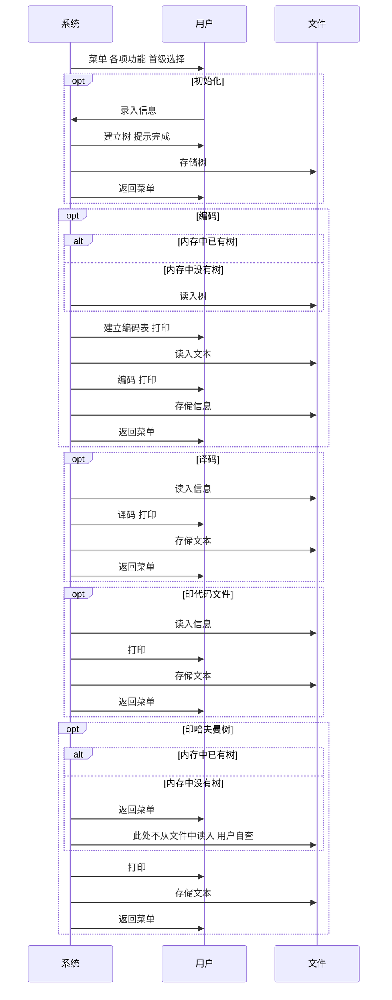

# 哈夫曼码编/译码系统 a brief intro note

[TOC]

### 利用规则

所有源代码以utf-8编码。为避免编码不同的问题，所有在控制台打印的提示均为英语，源代码的注释也大多是英语。

每一处待输入的部分之前，系统都会打印提示性语句，按照提示输入即可。本系统没有对汉字编码进行优化，请尽量全部使用英语字符！

源代码中访问待读取或写入文本文件的地址为相对地址，其中包括 `../` 表示上级目录，在使用时，请勿随意更改文本文件与可执行文件的地址，以免程序崩溃。所有需要用到的文本文件都已经添加到 `CMakeLists.txt` 文件中，使用者不管是调试或是正式使用时，必须确保所有需要的文件就位。若打开文件失败，则当前模块会直接结束，返回菜单。

如果需要查看编码表，可以试着选择编码模块，该模块除了完成编码功能外，还提供生印编码表。

使用请注明本家和作者，或者github的地址。有任何疑问欢迎联系，联系方式大概可以从github主页上找到。祝使用愉快。

### 程序目的

笔者设计并实现一个写一个哈夫曼码的编/译码系统。 该系统包括了常见的编/译码系统，通过根据规则规划每个字符在树中的位置，并且可以运用到信息的编码和解码操作中。

1. I：初始化（Initialization）。从终端读入字符集大小n，以及n个字符和n个权值，建立哈夫曼树，并将它存于文件hfmTree中；
2. E：编码（Encoding）。利用已经建好的哈夫曼树（如不在内存，则从文件hfmTree中读入），对文件ToBeTran中的正文进行编码，然后将结果存入文件CodeFile中；
3. D：译码（Decoding）。利用已建好的哈夫曼树将文件CodeFile中的代码进行译码，结果存入文件TextFile中；
4. P：印代码文件（Print）。将文件CodeFile以紧凑格式显示在终端上，每行50个代码。同时将此字符形式的编码文件写入文件CodePrin中；
5. T：印哈夫曼树（Treeprinting）。将已在内存中的哈夫曼树以直观的方式（例如树或凹入表形式）显示在终端上，同时将此字符形式的哈夫曼树写入文件TreePrint中。

### 功能一览

> 此部分中，一级序列为各个相对独立的模块。二级序列为各模块中实现的功能。

1\. 初始化
	1.1 从控制台录入
	1.2 建立哈夫曼树
	1.3 存储哈夫曼树到指定文件中
2\. 编码
	2.1 从文件中录入哈夫曼树（若内存中无）
	2.2 建立哈夫曼编码表
	2.3 简短打印哈夫曼编码表情况
	2.4 录入指定文件中的文本
	2.5 编码
	2.6 存储编码结果到指定文件中
3\. 译码
	3.1 录入指定文件中的信息
	3.2 译码
	3.3 存储译码后的文本到指定文件中
4\. 印代码文件
	4.1 录入指定文件中的信息
	4.2 打印
	4.3 存储信息到指定文件中
5\. 印哈夫曼树
	5.1用凹入表形式打印哈夫曼树
	5.2 存储信息到指定文件中
0\. 退出

### 业务流程图



### 程序的实现过程

#### 全程量

```c++
#define MAX_NODE_NUM 1000
#define MAX_CH_ARRAY_NUM 1000
```

这两个全程量主要用于对字符型数组做长度限定，在初始化模块中，还用于对整型数组做长度限定（权重值）。该系统处理的字符量不会太多，所以此处上限被设置为1000。

#### 哈夫曼树

```c++
typedef struct {
    char ch;
    int weight;
    int parent, lChild, rChild;     // to locate
} HuffmanTreeNode;

typedef struct {
    HuffmanTreeNode *ht;
    int ht_size;
} HuffmanTree;
```

在创建哈夫曼树结构时，笔者在结点数组外另加了关于树结点数的变量。这样做虽将调用过程延长了一次，但是也有诸多便利，例如为编码时生成编码表提供便利，遍历树的时候有极强的稳定性，而且能更方便地找到树中的根结点。

在对树建立线索、插入删除结点频繁的使用场景下，我们习惯使用链表似的树，但在哈夫曼树中，笔者考虑到这样的树应该是较为稳定的，不需要增补结点。所以本系统采用的是数组类型存储树中的各个结点，这是因为从控制台读入所有信息之后，不需要再对原有的数据进行插入删除，如果需要，那就是另一种变相的初始化了，与其在插入删除某一特定结点后再对树的结构进行反复调整，不如重新读取，存入数组，再次生成树。

基本操作：

1. 预处理

```c++
void Pre_HT(HuffmanTree &ht);
```

&emsp;&emsp;初始条件：在调用前需要定义变量。

&emsp;&emsp;操作结果：初始化树的长度，方便判断内存中是否有树。

2. 初始化功能模块的入口函数

```c++
int Init_HT(HuffmanTree &ht);
```

&emsp;&emsp;初始条件：在调用前需要定义变量。

3. 建立树

```c++
void Create_HT(HuffmanTree &ht, int w[], char chs[], int n);
```

&emsp;&emsp;初始条件：在调用前需要定义变量，并且得到预处理前期用户的输入。

&emsp;&emsp;操作结果：存储树的数组中填入位置信息（左子、右子、父）。

4. 销毁树

```c++
void Destroy_HT(HuffmanTree &ht);
```

&emsp;&emsp;初始条件：在调用前需要定义变量，树中不需要有信息。

&emsp;&emsp;操作结果：数组的内存空间被删除，长度归零。

5. 直接打印和存储生值

```c++
void Print_HT_raw(HuffmanTree &ht);

void Save_HT(HuffmanTree &ht);
```

&emsp;&emsp;初始条件：树中各节点关系建立。

&emsp;&emsp;操作结果：按照 `index  ch  weight  left_child  right_child  parent` 格式输出到控制台或者指定文件。

6. 从文件中加载树到内存

```c++
void Load_HT(HuffmanTree &ht);
```

&emsp;&emsp;初始条件：内存中没有树，文件中的树应该是已经建立好各节点间关系的树，不需要再次比对权重建立关系。

&emsp;&emsp;操作结果：按照`index  ch  weight  left_child  right_child  parent`格式读取指定文件中的树到内存。

7. 解码功能模块的入口函数

```c++
void Decoding(HuffmanCoder &hc, HuffmanTree &ht)
```

&emsp;&emsp;初始条件：树中各节点关系建立。

&emsp;&emsp;操作结果：读取指定文件中的信息并解码。虽然此处传入了哈夫曼编码表，但在实际解码过程中并没有用到。

8. 打印功能模块的入口函数

```c++
void Print_HT(HuffmanTree &ht, const string &print_command);
```

&emsp;&emsp;初始条件：树中各节点关系建立。

&emsp;&emsp;操作结果：通过函数内调用递归函数以凹入表形式打印。

#### 哈夫曼编码表

```c++
typedef struct {
    char ch;
    char *p_string;
} HuffmanCoderNote;

typedef struct {
    HuffmanCoderNote *hc;
    int hc_size;
} HuffmanCoder;
```

与哈夫曼树结构相似，笔者处理哈夫曼编码表结构时也也增加了结点数的变量，该变量在最初就可以被计算出，如下所示：

```c++
void Create_HC(HuffmanCoder &hc, HuffmanTree &ht) {
    hc.hc_size = (ht.ht_size + 1) / 2;
    hc.hc = new HuffmanCoderNote[hc.hc_size];
```

该变量的运用范围较多，除方便遍历以外，在生成各符号对应的编码时也大显身手。

基本操作：

1. 编码功能模块的入口函数

```c++
void Encoding(HuffmanCoder &hc, HuffmanTree &ht);
```

&emsp;&emsp;初始条件：在调用前需要定义变量。

&emsp;&emsp;操作结果：对于树的每一个字符生成编码表并打印，后续将指定文件中的文本编码并输出到控制台和指定文件。

2. 建立编码表

```c++
void Create_HC(HuffmanCoder &hc, HuffmanTree &ht);
```

&emsp;&emsp;初始条件：树中各节点关系建立。

&emsp;&emsp;操作结果：根据树中各个字符的位置生成哈夫曼编码并存储在哈夫曼编码表的数组中。

3. 销毁编码表

```c++
void Destroy_HC(HuffmanCoder &hc);
```

&emsp;&emsp;初始条件：在调用前需要定义变量。

&emsp;&emsp;操作结果：数组的内存空间被删除，长度归零。

4. 直接打印生值

```c++
void Print_HC_raw(HuffmanCoder &hc);
```

&emsp;&emsp;初始条件：编码表已生成。

&emsp;&emsp;操作结果：按照 `ch  code` 格式输出到控制台或者指定文件。


5. 实现编码

```c++
void Encode(HuffmanCoder &hc);
```

&emsp;&emsp;初始条件：编码表已生成，指定文件可以正确地被打开。

&emsp;&emsp;操作结果：编码。将编码结果打印在控制台，并存储到指定的文件。

#### 简洁的主函数

话不多说，主函数中已体现系统大致的流程，以及各个模板的入口：初始化、编码、解码、两个打印。接下来，笔者将依次介绍各个模块，让观者得以明瞭。

```c++
int main() {
    int dept_ch;
    string continue_string;
//    system("mode con cols=130 lines=60");
    HuffmanTree ht;
    HuffmanCoder hc;
    Pre_HT(ht);
    while (true) {
        dept_ch = Menu();
        switch (dept_ch) {
            case 1:
                Init_HT(ht);
                break;
            case 2:
                Encoding(hc, ht);
                break;
            case 3:
                Decoding(hc, ht);
                break;
            case 4:
                Print_CodeFile();
                break;
            case 5:
                Print_HT(ht, "ch");
                break;
            case 0:
                exit(0);
                break;
            default:
                cout << "invalid func " << endl;
                break;
        }
        cout << "enter any to continue" << endl;
        cin >> continue_string;
    }
    return 0;
}
```

#### 稳定的目录函数

先来看输入部分的变量定义过程：

```c++
	char dept_ch;
```

此处选用char类型来作为用户输入选择模块的指标，是因为字符类型可以更加直观地匹配各个模块的首字母，令用户的选择更多样，同时也更加人性化。下列是分配返回的switch选择器，原本为char类型的dept_ch丧失了其存储char类型值，而是变成了int一样的用法，这是为了方便返回主函数后可以做快速的调用模块。

```c++
    switch (dept_ch) {  // emm if someone like to enter letter you know...
        case 'I':
        case 'i':
        case '1':
            dept_ch = 1;
            break;
        case 'E':
        case 'e':
        case '2':
            dept_ch = 2;
            break;
        case 'D':
        case 'd':
        case '3':
            dept_ch = 3;
            break;
        case 'P':
        case 'p':
        case '4':
            dept_ch = 4;
            break;
        case 'T':
        case 't':
        case '5':
            dept_ch = 5;
            break;
        case 'Q':
        case 'q':
        case '0':
            dept_ch = 0;
            break;
        default:
            dept_ch = 100;   // pitifully, dept_ch var is changed to char so 114514 cannot be its value
    }
```

#### 重新认识创建树的过程

得益于c++的一些特性，初始化树的各个结点变得轻松。在此处，笔者将一开始没有建立结构之前的生数组左子右子和父都设置为-1，因为这是数组中元素的下标，-1绝对是一个不合法的值，它被用于表示空状态，没有左子右子和父时，按照-1来判断就好。

```c++
void Create_HT(HuffmanTree &ht, int w[], char chs[], int n) {
    // n num of chars  w each weight
    if (n <= 1) return;

    ht.ht = new HuffmanTreeNode[2 * n - 1];
    ht.ht_size = 2 * n - 1;

    int i = 0;  // def value
    int s1, s2;

    for (i = 0; i < n; ++i) ht.ht[i] = {chs[i], w[i], -1, -1, -1};
    // -1 means none

    for (; i < ht.ht_size; ++i) {
        Select_min(ht, i, s1, s2);  // ref s1 s2 to store the least two weights' indexes
        ht.ht[s1].parent = ht.ht[s2].parent = i;
        ht.ht[i].lChild = s1;
        ht.ht[i].rChild = s2;
        ht.ht[i].weight = ht.ht[s1].weight + ht.ht[s2].weight;
        ht.ht[i].parent = -1;
        ht.ht[i].ch = '\0';
    }
    cout << "construction of Huffman Tree completed " << endl;
}
```

简单提及， `Select_min(ht, i, s1, s2);` 会将更小权重的值设置在s1。建立树后，是保存树的模块：

```c++
void Save_HT(HuffmanTree &ht) {
    fstream f;

    f.open("../hfmTree.txt", ios::out); // due to clion ../ is needed
    if (!f.is_open()) {
        cout << "open file error" << endl;
        return;
    }

    f << ht.ht_size << endl;
    for (int i = 0; i < ht.ht_size; i++) {
        f << ht.ht[i].ch << ' ' << ht.ht[i].weight << ' ' << ht.ht[i].lChild << ' ' << ht.ht[i].rChild << ' '
          << ht.ht[i].parent << endl;
    }
    f.close();
    cout << "saving of Huffman Tree completed " << endl;
}
```

不难看出，笔者使用单个空格作为各结点内各值之间的分割。这是因为该输出到文件，是为了方便下一次读取，打印的结果也是一堆生值（原始的值），虽然不方便观者阅读，但对于系统后续从文件中读入树的过程，则更加方便可行。如果需要直观的方式展现哈夫曼树，用另一个打印功能，好吗？当然，在这一部分上稍作修改，你就可以输出成其他类型的格式，比如 .csv文件，增加一行表头的输出即可。当然c++并没有对.csv文件太多宽容，笔者花心思读入.csv文件就有些弄巧成拙了。输出到文件的格式如下：

```
5
a 10 -1 -1 3
b 20 -1 -1 4
c 15 -1 -1 3
  25 0 2 4
  45 1 3 -1

```

#### 生成编码表

编码模板中复杂的一部分是建立哈夫曼编码表，有了编码表，编码之难就迎刃而解。首先是规定编码表的长度，因为编码表记录的编码数量就是一开始再初始化中输入的n，所以按照计算树结点数量的规则反推算就可以得到编码表长度的表达式。或者，编码表中只记录各个叶子结点的编码，所以根据树结点也可以推算出，如下：

```c++
    hc.hc_size = (ht.ht_size + 1) / 2;
```

后续，我们定义了一个字符数组ch用于临时存储在规划编码时的临时字符串。得益于c++学习一些保姆语言的特性，笔者可以使用new方法建立cd数组，但是在最后要记得清空回收内存。

```c++
    char *cd = new char[hc.hc_size];
    cd[hc.hc_size - 1] = '\0';  // actually cd is kinda string
```

```c++
    delete[]cd;
```

该字符串在后续会存储每个叶子结点所处的位置信息，并在最后赋值给编码表中该字符对应的编码数组。先来看看笔者是如何确定叶子的位置信息的吧。所有叶子结点，默认是在初始化时输入的那一些，本就储存在树的数组的最先端，可以在上一小节中输出到文件的格式窥见。对于每个叶子结点，我们先访问其父结点，再使用父结点中左子右子的信息，确定该叶子结点是左子还是右子，0表示左子，1表示右子，后续一直对于其父结点进行访问，确定左子还是右子，并记录位置信息，直至遇到根结点，实现如下：

```c++
        for (c = i, f = ht.ht[i].parent; f != -1; c = f, f = ht.ht[f].parent)
            // if f -1 means it's a root node
            if (ht.ht[f].lChild == c) cd[--start] = '0';
            else cd[--start] = '1';
        hc.hc[i].p_string = new char[hc.hc_size - start];   // wara sugiru
```

#### 用编码表编码

有了编码表后，只需要找到特定字符，再输出它对应的编码即可，你能想象到的简单：

```c++
    for (int i = 0; i < strlen(ch); i++)
        for (int j = 0; j < hc.hc_size; j++)
            if (ch[i] == hc.hc[j].ch) {
                // this section's function can be seen as
                // output some string
                cout << hc.hc[j].p_string;
                f_out << hc.hc[j].p_string;
                break;
            }
```

#### 用树解码

说实在的，笔者认为，在解码时使用哈夫曼树而不是哈夫曼编码表会更快速。笔者可以想到使用编码表解码的方法是，对于一段待解码的信息，一遍一遍跟所有编码表中的编码匹配。每一次匹配标记之后的信息，如果一致，则提取文字并从匹配成功的后一个数值开始，即移动标记，直到所有数值都被匹配完成。

而使用哈夫曼树解码，这个过程就变成了从根结点寻找叶子结点的过程，找到叶子结点后，输出字符即可。

```c++
    int p = root;
    int pre = -1;   // pre proc
while (i < strlen(ch)) {    // u can use for loop if u like
        while (p != -1) {
            if (ch[i] == '0') {     // 0 means left branch
                pre = p;
                p = ht.ht[p].lChild;
            } else {
                pre = p;
                p = ht.ht[p].rChild;
            }
            i++;
        }
        cout << ht.ht[pre].ch;
        f_tf.put(ht.ht[pre].ch);

        i--;
        pre = -1;
        p = root;
    }
```

#### 打印的多选择思路

打印的入口函数，其实并不真正做到打印这件事本身，而是在做完一些预先工作之后，再次调用其他函数。

```c++
void Print_HT(HuffmanTree &ht, const string &print_command) {
    int root_index = ht.ht_size - 1;  // generally the root node is the last one.
    fstream f;  // the file to store result of tree printing
    f.open("../TreePrint.txt", ios::out);
    if (!f.is_open()) {
        cout << "open file error " << endl;
        return;
    }

    for (int i = 0; i < ht.ht_size; i++) if (ht.ht[i].parent == -1) root_index = i;
    if (print_command == "weight") return Print_HT_weight(f, ht, root_index, 0, 0);
    else if (print_command == "ch") return Print_HT_ch(f, ht, root_index, 0, 0);

    f.close();
    cout << "saving of print_result completed " << endl;
}
```

在此，函数在开始正式打印工作之前，还预先打开了文件并用引用方式传递给真实打印的函数。因为该模块除了打印以外还需要将打印结果存入文本文件中，边打印边写入文件，打印在控制台的内容和文件中的内容是一样的。

观者可以自己在源文件中的主函数更改传入参数 `print_command` 来控制打印和储存的最终的样式。此处笔者将该函数的取值限制在了"weight"与"ch"，分别打印权重值和字符。观者可以自己仿照编写其他期望输出样式。打印字符时，由于一些结点并没有字符，是中间结点，既不是根也不是叶，笔者在此默认用'_'代替显示。

按理说，如果只是控制输出的数值为何物，完全不需要再次调用，直接写在一个函数中就可以。但笔者如是做了，因为各个真实打印的函数之间存在相互调用，形成递归过程。而上方观者所见的是第一次调用的入口，结束打印之后才能抵达递归的出口。此处笔者选择的打印方法是较为简单的凹入表，即树以从上至下的样式转90°，每个真实打印的函数基本流程是：若该结点存在右子树，访问该结点的右子树并打印；打印该结点；若该结点存在左子树，访问该结点的左子树并打印。

### 调试过程记录

#### 菜单选项使用char类型

若用户使用字符来选择模块，int类型无法读入，从而导致switch按照default处理，直接退出系统。后续修改成char类型，可以正常读入字符，但是输入数字的话也会按照字符形式存储。

#### 每个模板返回主函数

```c++
        cout << "enter any to continue" << endl;
        cin >> continue_string;
```

此处的 `continue_string` 是c++区别于c之一的字符串变量，得到用户输入之后再回到菜单。注意，此处有一点待优化，如果用户不输入任何，只是按下回车键则不能回到菜单。这虽然是一个不足，但如果把提示语句改为 `cout << "enter \'c\' to continue" << endl;` ，后方增加判断，令其显性地向用户提出输入特定字符才得以返回菜单。

#### 选用凹入表形式打印

在最初，笔者使用了直观方法打印树，大致的实现流程是定义一个二维数组，每行存储各层的结点，对没有字符的结点和叶子结点，分别做标记，以便在后续打印时区分。遍历完树之后，计算每一层开始打印时左方空格数量并输出，随后打印各层结点，如是打印完所有结点。但是这样的操作使用二维数组占内存较多，使用率低，在本系统先前给出 的全程量来看，应该是一个1000×1000的字符二维数组，而且笔者在使用字符型二维数组时遇到一些困难，调试需要改动的地方较多，并且输出每一层还需要一个变量记录层数以判断是否完全输出。笔者改用凹入表形式打印。由于其自身的特点，打印树时不需要额外的变量再次储存每一个结点，而是通过中序遍历（在此处是右中左的顺序）遍历即打印、存储。

#### 使用数组形式存储树

笔者将树的各个结点存储在数组中，即顺序结构存储。在初始化树时，带有字符信息的结点可以被放在最前面，后续的一些中间结点和根结点则附带在数组中较后的位置。这样存储的树可以更加方便的建立编码表，只需要对前方一整块集中的区域进行定位操作生成编码即可。在哈夫曼树中，树的各个结点之间的关系应该是比较稳定的，在第一次生成树之后，结点与结点之间相对位置不发生变动，链式存储的好处无法体现出来。

### 附录

#### 文件一览

在生成调试该程序时使用的cmake文件包含了所有需要用到的文件。

```cmake
cmake_minimum_required(VERSION 3.20)
project(data_structure_finale)

set(CMAKE_CXX_STANDARD 11)

add_executable(data_structure_finale main.cpp func.h)

add_executable(hfmTree hfmTree.txt)
add_executable(TreePrint TreePrint.txt)
add_executable(CodeFile CodeFile.txt)
add_executable(CodePrint CodePrint.txt)
add_executable(TextFile TextFile.txt)
add_executable(ToBeTran ToBeTran.txt)
```

#### 函数一览

```c++
void Pre_HT(HuffmanTree &ht);

int Menu();

int Init_HT(HuffmanTree &ht);

void Create_HT(HuffmanTree &ht, int w[], char chs[], int n);

void Destroy_HT(HuffmanTree &ht);

int Select_min(HuffmanTree ht, int range, int &s1, int &s2);

void Print_HT_raw(HuffmanTree &ht);

void Print_HC_raw(HuffmanCoder &hc);

void Print_HT(HuffmanTree &ht, const string &print_command);

void Print_HT_weight(fstream &f, HuffmanTree &ht, int ind, int sh, int layer);

void Print_HT_ch(fstream &f, HuffmanTree &ht, int ind, int sh, int layer);

void Save_HT(HuffmanTree &ht);

void Load_HT(HuffmanTree &ht);

void Encoding(HuffmanCoder &hc, HuffmanTree &ht);

void Create_HC(HuffmanCoder &hc, HuffmanTree &ht);

void Destroy_HC(HuffmanCoder &hc);

void Encode(HuffmanCoder &hc);

void Decoding(HuffmanCoder &hc, HuffmanTree &ht);

void Print_CodeFile();
```

#### 感谢

感谢<font face='Source  Han Sans JP'>琴葉葵</font>，真的感谢。

